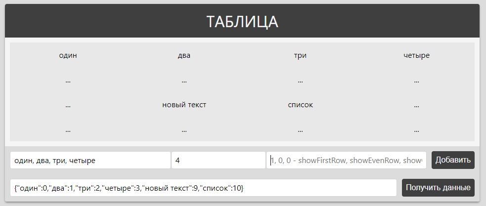

Еще не готово:
- insert_row(row_after_index) - добавляет строку после указанной в параметре строки.
- add_row() - добавляет строку в конец таблицы.
- get_data() - получает JSON объект данных из таблицы.
- clean_table() - очищает таблицу от данных

[Демо](http://snvoke.github.io/table/)
